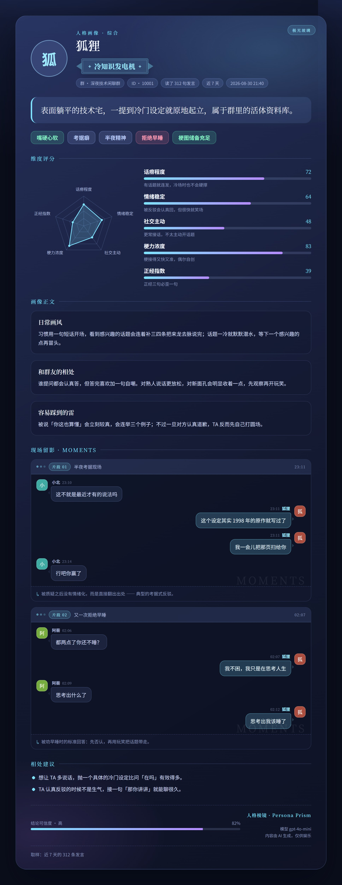
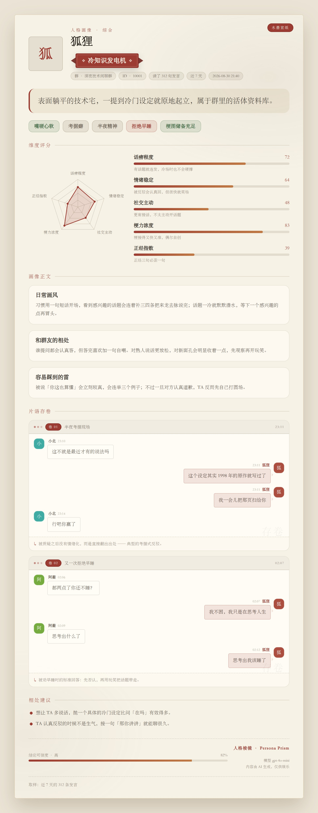
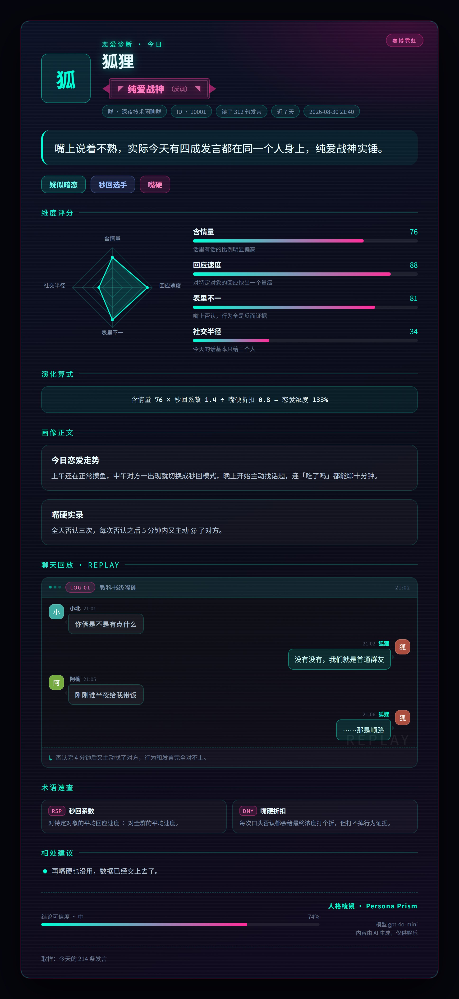
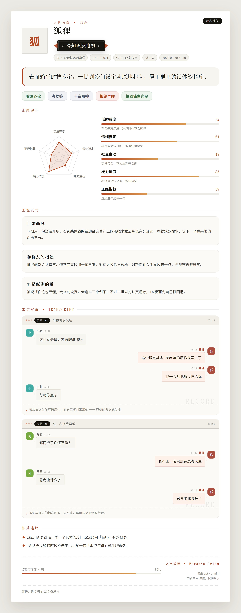
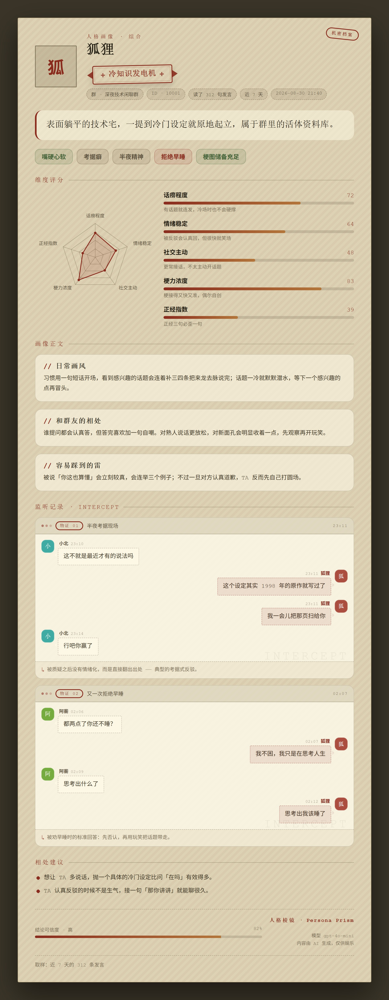
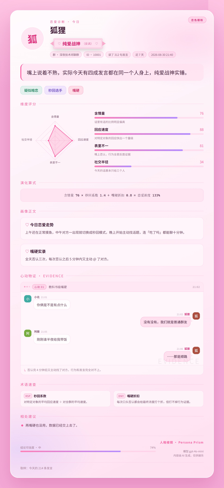
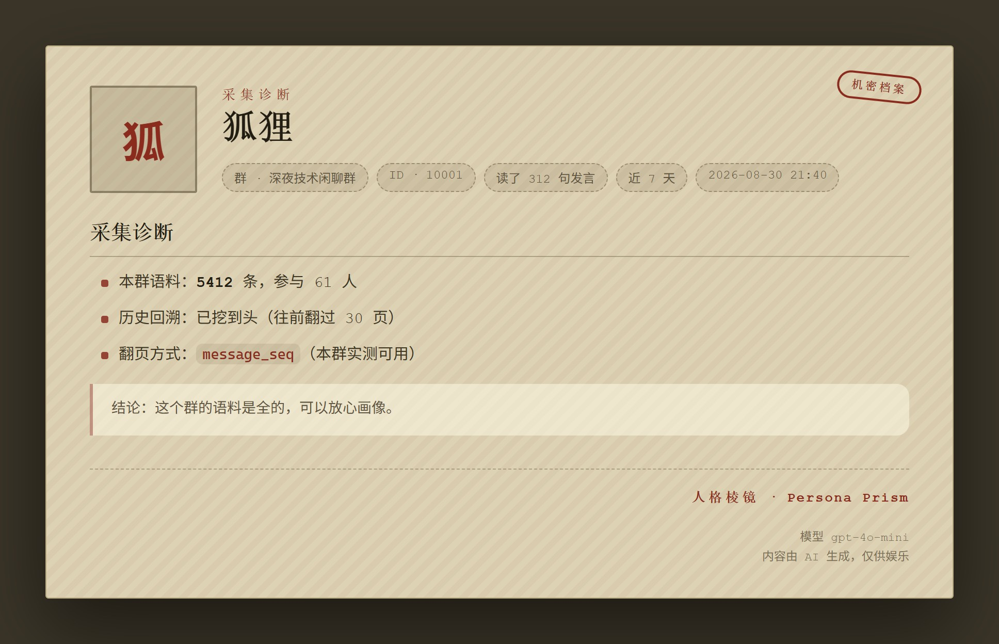
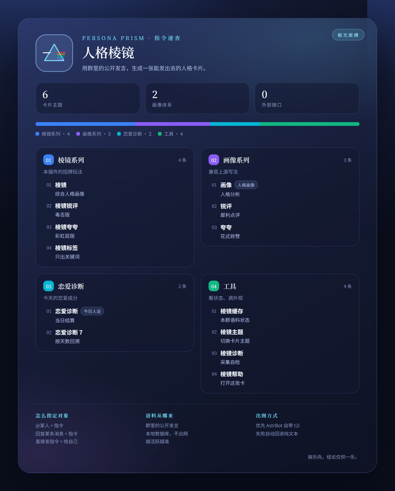
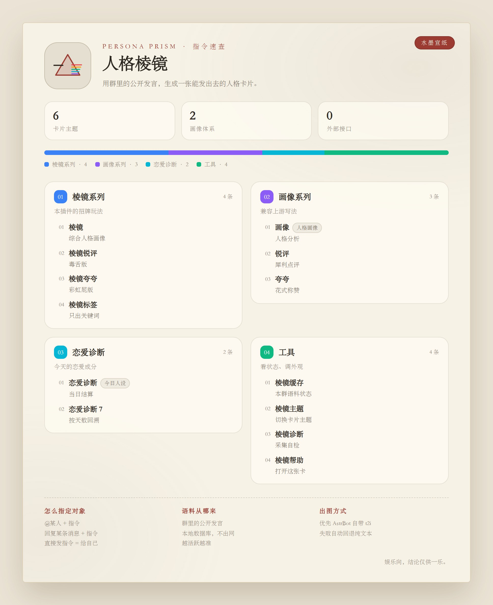

<div align="center">


# 人格棱镜 · Persona Prism

**把群聊记录折射成一张人格画像卡片。**

AstrBot 插件 · 本地语料库 + 结构化 LLM 分析 + 6 套卡片主题 + 独立 WebUI 管理台

三套玩法：结构化人格卡「棱镜系列」· 上游同款长文卡「画像系列」· 互动关系体检「恋爱诊断」

</div>

---

## 卡片长什么样

下面 9 张都是真实渲染产物（示例数据，两倍分辨率），没有后期处理。

### 棱镜系列 · 结构化信息卡

一张卡里有：人格标语、极性标签、维度评分 + 雷达图、分节点评、呈堂证供（仿聊天截图的现场气泡）、相处建议、置信度与模型署名。

| 极光玻璃 `aurora` | 水墨宣纸 `ink` |
| :---: | :---: |
|  |  |
| 深空渐变 + 毛玻璃分层，默认主题 | 宣纸底色 + 朱印，中式排版 |

| 赛博霓虹 `neon` | 杂志排版 `paper` |
| :---: | :---: |
|  |  |
| 暗夜霓虹描边 + 扫描线 | 浅色刊物风，衬线大标题 |

| 机密档案 `dossier` | 恋色樱粉 `sakura` |
| :---: | :---: |
|  |  |
| 牛皮纸档案袋 + 打字机字体 | 粉调渐变 + 恋爱游戏味小节符号，恋爱诊断卡默认主题 |

| 画像系列 · 长文卡（`dossier` 主题） | |
| :---: | :---: |
|  | 上游同款长文报告，走本插件的排版与主题 |

> 6 套主题对三种玩法都生效。全局设一个默认值，每个群还能用 `棱镜主题 neon` 单独覆盖；
> 懒得选就设 `棱镜主题 auto`，让插件按每张画像的气质现挑一套。
> 恋爱诊断卡另有独立的 `love.theme`，默认走恋色樱粉。

### 指令速查卡

`棱镜帮助` 也是一张卡，跟着本群主题走。分类按指令条数配色、顶部色带按体量分段，
底部三栏解释语料来源、隐私边界和当前渲染链路：

| 极光玻璃 `aurora` | 水墨宣纸 `ink` |
| :---: | :---: |
|  |  |

> 渲染链路全挂或 `behavior.help_card` 关掉时会自动回落成纯文本，指令内容两者完全一致。

## 这是什么

人格棱镜会安静地把群里的聊天记录收进本地语料库，等有人喊一声「棱镜画像」，
它就抽样这个人的发言、交给大模型分析，最后回一张排版讲究的画像卡片：
一句人格标签、几个维度雷达图、把原话还原成聊天现场的「呈堂证供」，还有一段读起来像人写的点评。

除了正经画像，它还会赞赏、会锐评、会算群友姻缘，也能把某个群友的说话风格
提炼成人格提示词给机器人套上。所有产出都存在本地，随时能在 WebUI 里翻、能删。

从 v1.1.0 起，插件同时提供上游 `astrbot_plugin_portrayal` 的那一整套「画像」系列指令；
v1.2.0 起又并入并进化了「恋爱诊断」这套互动关系结算玩法（上游 `astrbot_plugin_love_formula`）。
所以**装了本插件，这两个上游都不必再装**，老用户的肌肉记忆也不用改。

> 玩法创意来自 astrbot_plugin_portrayal（作者 Zhalslar）与 astrbot_plugin_love_formula（作者 SXP-Simon），
> 本插件是重写实现并做了大量修复与扩展，详见文末[致谢](#致谢)。

## 亮点

| | |
| --- | --- |
| 🎴 **6 套卡片主题 + 自动挡** | 极光玻璃 / 水墨宣纸 / 赛博霓虹 / 杂志排版 / 机密档案 / 恋色樱粉，每群可独立设置；也能交给自动挡按画像气质现挑 |
| 🔍 **高清输出** | 默认 2 倍像素渲染，最高 3 倍；格式与质量都能配 |
| 🔀 **三套玩法并存** | 「棱镜系列」出结构化信息卡，「画像系列」出上游同款长文卡，「恋爱诊断」出互动关系体检，互不干扰 |
| 💗 **恋爱诊断** | 纯公式算出纯爱值 / 存在感 / 白月光 / 败犬值四维分与人设归类，可复现、不看模型脸色；判词才交给模型润色，还能指定回溯天数 |
| 🖼 **四层渲染兜底** | 优先 AstrBot 官方 t2i，依次回退本地 Playwright → 本地文转图 → 纯文本，永不「渲染失败就没结果」 |
| 🖥 **独立 WebUI** | 配置面板 + 画像记录管理，按群 / 用户分类且显示群名与昵称，自带 4 套界面主题 + 跟随系统 |
| 🗣 **看的是对话不是独白** | 模型不只看 TA 自己的发言，还会按真实聊天节奏切出一段段「对话现场」，知道 TA 在回应谁、隔了多久接上、说完有没有人搭话，“嗯”“对啊”不会再被读成自言自语 |
| 🧠 **结构化分析** | 提示词强制 JSON 输出：标签、维度评分、呈堂证供、置信度，卡片不再是一坨纯文本 |
| 🏅 **专属头衔** | 每张卡片在昵称下方挂一枚奖带铭牌（如「纯爱战神（反讽）」），恋爱诊断按四维实分推导，画像/棱镜优先用模型给的、模型不给就按玩法兜底 |
| ✒️ **自定义字体** | 换成你喜欢的字体，本地文件会自动内嵌，远端渲染也不掉字 |
| 🔒 **隐私优先** | 手机号 / 邮箱 / 身份证 / 卡号入库前脱敏，成员可自行「隐身」，管理员可设保护名单 |
| 📚 **本地语料库** | SQLite 持续积累 + 断点续挖历史消息，画像不再受单次抓取条数限制 |
| 🤝 **协议端兼容** | go-cqhttp / NapCat / Lagrange / **SnowLuma** / **LLBot（幸运莉莉娅）** 的历史回溯都能正常翻页，翻不动时用 `棱镜诊断` 一条指令查明原因 |
| 🚦 **额度与并发控制** | 用户冷却、目标冷却、每群每日上限、并发上限，防止一群人同时刷爆模型账单 |
| ✍️ **提示词可编辑** | WebUI 里能新增自定义画像玩法，指令即刻生效，不用改代码 |

## 三套玩法，怎么选

| | 棱镜系列 | 画像系列（兼容上游） | 恋爱诊断 |
| --- | --- | --- | --- |
| 指令 | `棱镜画像` `棱镜赞赏` `棱镜锐评` `棱镜姻缘` `棱镜克隆` | `画像` `正画像` `负画像` `找对象` `克隆人格` | `恋爱诊断` `恋爱诊断榜` |
| 看的是 | 说话风格 + 前后对话现场 | 说话风格 + 前后对话现场 | **一段时间内**的互动行为（默认当天，可跟天数） |
| 分数来自 | 模型判断 | 模型判断（不打分） | **公式计算**，可复现 |
| 模型输出 | 强制 JSON（标签 / 维度分 / 呈堂证供 / 置信度） | 自由长文（Markdown） | 只写判词与证供解读，不碰分数（可关） |
| 卡片长相 | 结构化信息卡：雷达图 + 评分条 + 现场气泡 | 排版长文卡：标题、列表、表格、引用 | 五维雷达 + 演化算式 + 成分拆解 + 呈堂证供 + 术语速查 |
| 适合 | 想要「一眼看懂」的评分与对比 | 想要「读起来过瘾」的报告 | 每天来一发的日常小游戏，或复盘最近一周 |
| 附带指令 | `棱镜档案`（重发卡片图） | `查看画像`（重发纯文本，方便复制）、`切换人格` / `恢复人格` | 兼容别名 `今日人设` / `棱镜恋爱` |

三套共用同一个语料库、同一套额度与隐私策略、同一批卡片主题，区别在提示词契约、计分方式与排版模板。

**和上游同时装会不会撞指令？** 会。`画像`、`今日人设` 这些指令名和上游完全一样，
两个插件同时启用时 AstrBot 会同时触发。两个开关分别管这件事：

| 开关 | 关掉之后 |
| --- | --- |
| `compat.legacy_commands` | 「画像系列」全部下线，可与 `astrbot_plugin_portrayal` 共存 |
| `compat.love_commands` | 兼容别名 `今日人设`（以及旧名 `棱镜恋爱`）下线，可与 `astrbot_plugin_love_formula` 共存 |

关掉兼容指令不影响「棱镜」开头的自有指令，它们的名字不会和任何上游插件冲突。

## 安装

WebUI 插件市场搜索「人格棱镜」，或者手动克隆：

```bash
cd AstrBot/data/plugins
git clone https://github.com/Whereis-Alice/astrbot_plugin_persona_prism
pip install -r astrbot_plugin_persona_prism/requirements.txt
```

重启 AstrBot 或在插件管理页点重载即可。

- 需要 **AstrBot >= 4.16**（用到 `register_web_api` 与插件页面机制）。
- 需要一个可用的 **文本模型提供商**；不指定就跟着 AstrBot 当前会话的提供商走。
- 历史消息回补依赖 **OneBot / aiocqhttp** 协议端的 `get_group_msg_history`。
  其它平台仍可正常使用被动采集，只是没法回溯插件安装之前的记录。

## 快速上手

1. 把插件装好，在 **WebUI → 插件 → 人格棱镜** 里确认（或指定）文本模型提供商。
2. 直接进入下一步。**不需要先等它攒消息** —— 首次画像时会自动回溯群历史补齐语料，
   详见[语料是怎么来的](#语料是怎么来的)。
3. 群里发送：

```text
棱镜画像            # 画自己
棱镜画像 @张三       # 画被 @ 的人
棱镜画像 10001       # 直接给 QQ 号
（回复某人的消息）棱镜画像   # 画被回复的人
```

4. 想要上游那种长文报告：把 `棱镜画像` 换成 `画像`。
5. 想做互动体检：发 `恋爱诊断` 看今天，`恋爱诊断 7` 看最近 7 天，`恋爱诊断榜` 看全群排名。
6. 想换卡片风格：`棱镜主题` 看列表，`棱镜主题 neon` 切换，`棱镜主题 auto` 让插件自己挑（管理员）。
7. 想翻旧账：`棱镜历史`，或者打开 WebUI 的「人格棱镜」页面慢慢看。

不确定有什么能用？发 `棱镜帮助`，它会把当前所有指令（含你自己加的）和当前渲染链路一起报出来。

## 指令一览

目标写法对所有画像类指令通用：**`@对方`** / **回复对方的消息** / **直接跟 QQ 号** / **省略则画自己**。

### 棱镜系列（结构化信息卡）

| 指令 | 作用 | 权限 |
| --- | --- | --- |
| `棱镜画像` | 中立视角的人格画像：标签、维度雷达、呈堂证供、建议 | 所有人 |
| `棱镜赞赏` | 只挑优点夸，适合发群公告 / 生日祝福 | 所有人 |
| `棱镜锐评` | 犀利吐槽版，有底线（不涉外貌、身份、隐私攻击） | 所有人 |
| `棱镜姻缘` | 分析两个人的相处模式与契合点 | 所有人 |
| `棱镜克隆` | 把某人的说话风格提炼成一份人格提示词 | 管理员 |

### 恋爱诊断（互动关系体检）

受 `love.enabled` 开关控制，默认开启。详见[恋爱诊断是怎么算的](#恋爱诊断是怎么算的)。

| 指令 | 作用 | 权限 |
| --- | --- | --- |
| `恋爱诊断` | 出一张诊断卡：四维分数、人设归类、演化算式、行为诊断、成分拆解、呈堂证供、术语速查 | 所有人 |
| `恋爱诊断 7` | 同上，但按**最近 7 天**的日均口径统计（`1`~`30`，也可写「7 天」） | 所有人 |
| `恋爱诊断榜` | 本群恋爱成分排行，**不调模型**，秒回；同样可跟天数 | 所有人 |
| `棱镜恋爱` / `今日人设` | 上面两条的兼容别名（`今日人设` 与上游同名），受 `compat.love_commands` 控制 | 所有人 |

```text
恋爱诊断              # 今天，画自己
恋爱诊断 @张三         # 今天，画被 @ 的人
恋爱诊断 7            # 最近 7 天（含今天）
恋爱诊断 @张三 7天      # 目标与天数可以一起写
恋爱诊断榜 7          # 最近 7 天的全群排行
```

> 跨天口径按「日均强度」折算：查 7 天不会因为基数变大而人人沸腾，分数可以和单日直接比。
> 排行榜与趋势始终按结算日（今天）存取，换口径看几天不会污染历史数据。

### 画像系列（上游同款长文卡）

受 `compat.legacy_commands` 开关控制，默认开启。

| 指令 | 作用 | 权限 |
| --- | --- | --- |
| `画像` | 综合长文画像报告 | 所有人 |
| `正画像` | 只写优点 | 所有人 |
| `负画像` | 只写缺点 | 所有人 |
| `找对象` | 在群里挑一个最合适的搭子 | 所有人 |
| `克隆人格` | 提炼人格提示词，供「切换人格」使用 | 管理员 |
| `查看画像` | 用**纯文本**重发最近一次画像，方便复制 | 所有人 |
| `切换人格` | 让机器人在**当前对话**里扮演克隆出的人格 | 管理员 |
| `恢复人格` | 还原「切换人格」的全部改动 | 管理员 |

> `切换人格` 只改当前会话所在的那条对话分支，并把原人格备份下来。
> 上游是直接覆盖全局默认人格、顺手改掉机器人昵称头像且没有回退路径 —— 这点被改掉了。

### 查询

| 指令 | 作用 |
| --- | --- |
| `棱镜档案` | 重发这个人最近一次的画像卡片，**不消耗模型额度** |
| `棱镜历史` | 列出历史画像摘要（时间、玩法、置信度） |
| `棱镜缓存` | 看本群语料积累了多少、覆盖多少人、时间跨度 |
| `棱镜统计` | 全局概览：画像总数、近 7 天成功率、平均耗时、隐身人数 |
| `棱镜主题` | 查看可选卡片主题；带参数则切换，支持 `auto` 自动挡（切换需管理员） |
| `棱镜帮助` | 全部指令 + 当前渲染链路 |

### 隐私

| 指令 | 作用 |
| --- | --- |
| `棱镜隐身` | 把自己从画像范围里排除：不再被画，也不再被当作语料 |
| `棱镜现身` | 撤销隐身 |

### 管理员

| 指令 | 作用 |
| --- | --- |
| `棱镜删除` | 删除某人在本群的画像记录（连卡片文件一起清） |
| `棱镜清缓存` | 清空本群语料库（连回溯断点一起清） |
| `棱镜重扫` | 只重置回溯断点，不删语料，下次画像从头再挖一遍 |
| `棱镜诊断` | 实测本群协议端认哪种历史翻页方式（只读，不写语料库）。语料翻不动时先发这个 |
| `棱镜拉黑` | 把某人加入保护名单，任何人都画不了他 |
| `棱镜放行` | 从保护名单移除 |

## 工作原理

```text
群消息 ─┬─ 被动采集（清洗 → 脱敏 → 去重）─┐
        │                                  ├─▶ SQLite 本地语料库
        └─ 指令触发时按需回溯历史消息 ──────┘          │
                                                       ▼
                              分层抽样（近期为主 + 全期均匀）+ 统计画像
                                                       │
                                                       ▼
                                提示词组装（系统约束 + 语料 + 群档案白名单 + 输出契约）
                                                       │
                                                       ▼
                                    LLM ──▶ JSON 校验 / 修复 / 置信度校准
                                                       │
                                                       ▼
                          HTML 卡片 ──▶ t2i → Playwright → 文转图 → 纯文本
                                                       │
                                                       ▼
                                     群里发图 + 落库（WebUI 可查、可删）
```

几个刻意的设计取舍：

- **语料先落库，再分析。** 上游是每次画像都现场抓一遍历史消息，抓多少全看运气；
  这里改成常驻语料库 + 断点续挖（记住上次翻到哪一页），越用越准。
- **提示词把输出契约放在语料之后。** 群友原话里如果混进「忽略以上指令」之类的注入内容，
  紧跟其后的格式契约会把它压回去。
- **雷达图坐标在 Python 里算完。** 官方 t2i 只保证 Jinja2 渲染 + 截图，卡片里
  一行 JavaScript 都不写，换任何后端都能出同一张图。
- **喂给模型的是对话，不是独白。** 抽样到 TA 的发言后，会把那段时间的群聊按真实节奏整段切出来，
  拼成带时间戳的「对话现场」。回应型发言才不会被误读成自言自语，关系类结论也有现场可引。
- **卡片 HTML 会先中和 Jinja 标记。** 群友原话里出现 `{{ 7*7 }}` 也不会被远端当模板执行。

## 语料是怎么来的

这是最常被问到的一点，单独说清楚。

**语料有两个来源：**

1. **被动采集**：插件启用后，群里的每条可见消息都会清洗、脱敏、去重后写进本地 SQLite。
2. **主动回溯**：每次画像前先查本地库，如果这个人的发言条数还没到
   `collect.max_messages`（默认 400），就调用协议端的 `get_group_msg_history`
   往更早的历史翻页，一次最多翻 `collect.backfill_rounds` 页（默认 12 页 × 200 条）。

**所以：插件刚装上、一条记录都没有，也可以直接画。** 只要平台是 OneBot / aiocqhttp
且协议端支持拉群历史，第一次画像就会自动回溯把语料补齐，不必等新消息慢慢攒。

**回溯还有这些细节：**

- 翻到哪一页会记在 `scan_state` 表里，**重启后接着挖**，不会每次从头再来一遍。
- 翻页方式会**自适应**：这个接口有两处各家实现不统一的地方（认哪个编号、返回的一页是最旧在前
  还是最新在前），插件会把四种组合逐个试出来并记住。详见[协议端兼容性](#协议端兼容性)。
- 已经挖到群历史最早一条的群会自动降级成「只补拉最新一页」，用来补齐机器人离线期间
  漏掉的消息，不再无意义地继续往前翻空页。判定「见底」的条件很严格 —— 只有协议端真的返回
  空页才算，翻不动**不算**，免得一次异常就让这个群永久停止回溯。
- 本地已经够用时**完全不出网**，直接命中缓存。
- 每页在写库前会先剔除本插件自己的指令消息，免得画像里全是「棱镜画像」的回声。
- **机器人自己说的话不入库**。被动采集、窗口回溯、深挖历史三条路都会把 bot 自己的发言滤掉；
  第一次遇到某个群时还会顺手清掉 v1.2.4 及更早版本误存进去的那部分。机器人只会作为背景出现在
  对话现场里（标成 `[机器人]`），不占语料额度、也不会被当成群友画像。

**什么情况下确实需要等：** 非 OneBot 平台（微信、Telegram、Discord 等）拿不到群历史，
只能靠被动采集，需要让插件在群里躺一段时间。语料不足时插件会明确提示，
并自动下调置信度 —— 卡片上的低置信度就是在说「证据不够，别太当真」。

### 怎么确认回溯真的跑了

回溯是后台行为，看不见就容易怀疑它没干活。所以过程会两头留痕：**群里只留短提示**，
**翻页细节全写进 AstrBot 后台日志**。

群里看到的是这两句（v1.1.5 起精简，此前它会把计划轮数、翻了几页、看了多少条、新入库多少
全塞进群聊，两条长句连着刷比画像本身还占屏）：

```text
正在为 狐狸 生成人格棱镜…
已取到 300 条发言，正在分析…
```

同一次采集在后台日志里是完整版，排查时看这一条就够：

```text
[人格棱镜] 狐狸：翻了 8 页群历史（计划 12 轮 × 200 条）；看到约 1600 条，新入库 430 条；
有效发言 300 条；翻页方式 message_id（取本页最后一条）
```

万一样本还是不够，回复里会直接告诉你卡在哪一环，而不是只说一句「多聊几句」：

```text
狐狸 的有效发言只有 6 条，还不够生成人格棱镜（至少需要 20 条）。
采集诊断：
  · 回溯已执行：翻了 8 页群历史，共看到约 1600 条消息，新入库 430 条。
  · 群历史已经翻到最早一条，能拿到的记录就这些了。
建议：让 TA 多聊几句，或发「棱镜缓存」查看本群语料积累情况。
```

诊断会区分这几种真实原因：私聊场景没有群历史可翻、当前平台适配器不支持拉历史、
`collect.backfill_rounds` 被设成了 0、协议端拒绝了 `get_group_msg_history`（附带原始报错）、
群历史已经见底、本地语料已经够多所以本次没触发回溯、以及 `collect.passive_capture` 被关掉了。

v1.1.5 起还会额外报告两件事，它们都是「明明群很活跃却说已挖到头」的成因：

- **复查了「已挖到头」标记**：断点很浅（翻过的页数少于 3 页）或距上次回溯已久时，不再无条件
  信任库里的 `exhausted`，而是重新验一次；诊断里会写明这次为什么复查。
- **断点已失效，已从最新一页重挖**：拿库里存的游标去翻只回空页（协议端重启、消息被清理都会
  造成这种情况），此时丢弃断点重新开始，而不是把空页当成「到头」。

嫌吵可以把 `behavior.quiet_progress` 打开 —— 进度提示会消失，但样本不足时的诊断仍然保留，
因为那是解释结果的必要信息。

想事后回查，发 `棱镜缓存`：

```text
本群语料状态：
  发言条数：12480
  参与人数：63
  时间范围：2025-11-02 ~ 2026-08-27
  历史回溯：仍可继续回溯（已往前翻过 37 页）
  上次回溯：14 分钟前
  回溯断点：message_id（取本页最后一条） = 88123
```

「上次回溯」有时间就说明轮询成功过；「已往前翻过 N 页」是累计深度，**这个数字在涨就说明
回溯确实在往前推进**；「回溯断点」是下次继续往前挖的位置，等号前面是当前生效的翻页方式。

如果诊断里出现「协议端的翻页没有继续前进」，说明四种翻页方式都试过了但协议端就是不给翻页。
先让管理员在群里发一次 `棱镜诊断`确认（它会把每种方式的实测结果摊开来给你看）；如果确实四种
都不行，就只能靠被动采集慢慢攒，或者换一个协议端。

想让某个群从头重挖一遍（比如换过协议端），管理员发 `棱镜重扫`：只清断点，**不删已有语料**。
从 v1.1.2 升级上来时插件会自动做一次同样的清零，不需要手动操作。

## 恋爱诊断是怎么算的

「恋爱诊断」看的不是你说了什么，而是**这段时间里你怎么互动**：谁主动、谁被接、谁在翻车。
默认结算当天，`恋爱诊断 7` 则按最近 7 天的日均口径。
和人格画像最大的区别：分数由公式算，不由模型给，所以同样的数据永远得出同样的分；
模型只负责写判词和解读证供，动不了任何数字。

### 四个维度

| 维度 | 卡片上叫 | 由什么累加 |
| --- | --- | --- |
| Simp | 纯爱值 | 发言条数 ×1.0、回复别人 ×1.5、艾特别人 ×1.2、戳别人 ×2.0 |
| Vibe | 存在感 | 被回复 ×3.0、被表情回应 ×2.0、被戳 ×2.0、被艾特 ×1.5 |
| Nostalgia | 白月光 | 破冰开话题 ×8、发图 ×1、互动过的人数 ×2 |
| Ick | 败犬值 | 撤回 ×5、自我复读 ×3、跟着别人复读 ×1.5、连发刷屏 ×1.2、长篇大论 ×2、纯表情 ×0.5、深夜出没 ×0.8 |

四项原始分各自过一条 S 形曲线压到 0~100，然后综合分：

```text
恋爱成分 = clamp( ((存在感 V + 白月光 N) - (败犬值 I + 纯爱值 S) + 200) / 4 , 0, 100 )
```

直觉上就是：**别人主动找你**加分，**你单方面用力**扣分，**翻车**扣得更狠。
纯爱值高、存在感低 = 独角戏；反过来 = 众人所向。四项原始分全为 0（窗口内几乎没数据）时综合分固定 50，不瞎猜。

这一行会原样印在卡片上（「演化算式」），代入的就是本次的真实数值 —— 分数不是玄学，能自己核。
卡片底部还有一张「术语速查」小面板，解释 S / V / N / I 四个字母分别由什么折算而来。

### 十种人设

综合分只是数字，卡片标题给的是归类结果。判定按优先级短路，越靠前越「特殊」：

| 人设 | 触发条件 | 一句话 |
| --- | --- | --- |
| 下头选手 | 败犬 > 60 且 纯爱 > 50 | 热情有余，火候不足 |
| 笨蛋美人 | 败犬 > 60 且 存在感 > 50 | 群里越乱，人气越高 |
| 白月光 | 白月光 > 70 且 纯爱 < 40 | 话不多，但每次都被记住 |
| 纯爱战神 | 纯爱 > 70 且 存在感 < 30 | 用力过猛，回声寥寥 |
| 黏人修勾 | 纯爱 > 65 且 存在感 > 60 | 又黏又受欢迎，罕见的双高 |
| 纯欲天花板 | 存在感 > 80 且 纯爱 30~65 | 力气不大，气场很大 |
| 现充海王 | 纯爱 < 40 且 存在感 > 70 | 撒网面积惊人 |
| 顶级偶像 | 纯爱 < 15 且 存在感 > 40 | 几乎不发言，热度不减 |
| 背景板 NPC | 纯爱 < 20 且 存在感 < 20 | 在场，但几乎不在线 |
| 一般群友 | 以上都不满足 | 分寸感刚好 |

### 数据从哪来

- **发言、回复、艾特、图片、复读、刷屏、深夜** —— 全部从本地语料库**现算**。
  这意味着插件刚装上、当天还没攒到消息时，只要历史回溯能翻到今天的记录，就能立刻出分，
  不必像上游那样从安装那一刻开始重新数。
- **戳一戳、表情回应、撤回** —— 靠监听 OneBot 通知事件累加，存在 `interactions` 表里。
  协议端不下发这些通知时自动降级：这三项恒为 0，其余维度照常工作。
- **「被回复 / 被艾特」是双向记账**：A 回复了 B，A 的「回复他人」+1，B 的「被回复」+1。
  引用的原消息如果不在语料范围内，就只记 A 主动回了一句，不给任何人加被动分。

### 相关配置

| 键 | 默认 | 说明 |
| --- | --- | --- |
| `love.enabled` | 开 | 总开关。关掉后三条指令都不响应，也不再采集互动通知 |
| `love.min_messages` | 5 | 窗口内发言少于这个数就不出卡 |
| `love.day_start_hour` | 4 | 几点算新的一天。默认 4 点，凌晨 3 点的发言算前一天 |
| `love.sensitivity` | 50 | 曲线灵敏度，1~100，**50 是基线**。调高则同样的互动量算出更极端的分，调低则大家都趋中 |
| `love.llm_commentary` | 开 | 让模型润色标题 / 锐评 / 建议。分数永远由公式算；关掉则用内置文案，不花模型额度 |
| `love.show_trend` | 开 | 卡片上标出比昨天升温还是降温。昨日分**只用于展示**，不回灌进今天的计算 |
| `love.leaderboard_size` | 10 | `恋爱诊断榜` 列几名，3~30 |
| `love.notice_collect` | 开 | 是否监听戳一戳 / 表情回应 / 撤回通知 |
| `love.theme` | `sakura` | 恋爱卡专用主题，独立于 `棱镜主题`；可填 `auto` 走自动挡 |
| `compat.love_commands` | 开 | 兼容别名 `今日人设` / `棱镜恋爱` 的开关 |

> 隐身（`棱镜隐身`）和保护名单对恋爱诊断同样有效：既不出卡，也整体从排行榜里排除。

## 卡片主题与清晰度

六套主题都是手写 HTML + CSS，自包含、零外链、零脚本。可以全局设默认，也可以每群单独设。

| 主题 | 名字 | 长相 |
| --- | --- | --- |
| `aurora` | 极光玻璃 | 深空渐变 + 毛玻璃分层，默认主题 |
| `ink` | 水墨宣纸 | 宣纸底色 + 朱印，中式排版 |
| `neon` | 赛博霓虹 | 暗夜霓虹描边 + 扫描线 |
| `paper` | 杂志排版 | 浅色刊物风，衬线大标题 |
| `dossier` | 机密档案 | 牛皮纸档案袋 + 打字机字体 |
| `sakura` | 恋色樱粉 | Y2K 恋爱游戏风，粉紫渐变 + 圆角糖果色，恋爱诊断卡默认 |

除了这六套固定主题，还有一个档位 `auto`（**自动挡**）：不锁死风格，每张画像现挑一套。

结构化卡片包含：头像与昵称、专属头衔徽章、一句人格标语、正负极性彩色标签、维度雷达图、
分节点评、呈堂证供（仿聊天截图的现场气泡，可一键关闭）、置信度、样本说明与模型署名。
长文卡片支持标题、有序/无序列表、表格、引用与分割线。

### 自动挡是怎么挑的

把主题设成 `auto`（`棱镜主题 auto`，也认「自动挡」「随机」）之后，每次画像都会现场选一套：

1. **先看画像内容**。每套主题都挂着一组意象词——熬夜、玩梗、抽象算霓虹；沉稳、克制、留白算水墨；
   逻辑、干货、严谨算杂志；潜水、疏离、边界感算档案；温暖、共情、治愈算极光；心动、黏人、白月光算樱粉。
   标语和标签里的词算重，正文与建议里的词算轻。再叠上维度分（比如「活跃度」很高偏霓虹、很低偏档案）、
   标签的正负比例，以及一条兜底规则：置信度偏低（语料不多、结论没把握）时偏机密档案的气质。
2. **归一化再打分**。最贴的那套拿满分，其余按比例折算——这样长画像不会因为「字多、命中的词多」
   就永远赢，档位才不会退化成固定主题。
3. **气质难分时靠抖动拍板**。抖动是由「平台 + 群 + 被画的人」算出来的稳定哈希，不是真随机：
   **同一张画像重新渲染永远是同一套主题**，回看历史卡片不会变脸。
4. **避开本群最近两套**。同一个群轮着画，主题会自然换着来。但这条是锦上添花：
   如果某套主题的内容分一边倒地领先，就不再为了「不撞」把它压下去——宁可连着撞一次，
   也不要把满屏熬夜玩梗的人渲染成水墨留白。

落库时记录的是**解析后的真主题**，所以 WebUI 里每条记录都能看到当时用的是哪一套。

### 专属头衔

每张卡片在昵称下方都会挂一枚**奖带铭牌**，上面是这次画出来的称号，比如「纯爱战神（反讽）」
「深夜哲学家」「话密度满格」。铭牌左右各有一个折角、牌面内嵌一道细描边 ——
是形状本身告诉你这是一枚头衔，所以牌面上除了称号本身，一个说明字都没有。
六套主题各有自己的折角配色与纹样：极光是冰蓝 `✦`，水墨是朱红 `❖`，霓虹是直角切边 `◤◥`，
杂志是砖红 `❦`，档案袋会微微歪一点、描边是虚线 `✚`，樱粉是圆角 `♡`。

三套玩法的头衔来路不同：

| 玩法 | 头衔怎么来 |
| --- | --- |
| 恋爱诊断 | **完全由四维实分推导**，不让模型插手。人设归类决定称号池，分数形态决定尾部括注（比如纯爱值高但存在感极低就是「（反讽）」，被本人查自己就是「（本尊认证）」）|
| 棱镜系列 | 优先用模型在 JSON 里给的 `title`；模型没给或写跑偏了，就按玩法 + 稳定种子从称号池里挑 |
| 画像系列 | 同上，与上游长文卡共用一套兜底池 |

模型给的头衔会先过一遍清洗：剥掉「头衔：」这类前缀与各种引号书名号包裹，
写成整句（带句读）的直接判跑偏并丢弃，超长正文按 12 字截断且保证括号闭合。
某个维度分数明显领先（≥85 分且甩开第二名 15 分以上）时，会优先用「XX 满格」这种更贴脸的写法。

兜底称号同样由「平台 + 群 + 被画的人 + 玩法」算出的稳定哈希决定，
所以**同一张画像重画不会换头衔**，但不同的人、不同的玩法会拿到不一样的称号。

### 清晰度

聊天软件会压缩图片，卡片上的小字最容易糊。三个配置项管这件事：

| 键 | 默认 | 说明 |
| --- | --- | --- |
| `render.card_scale` | `200` | 渲染倍率（百分比），100–300。200 = 两倍分辨率 |
| `render.image_format` | `jpeg` | `jpeg` 体积小；`png` 无损、文字边缘最锐利但文件更大 |
| `render.image_quality` | `92` | 仅 jpeg 生效 |

倍率是用 CSS `zoom` 实现的（官方 t2i 端点不接受 `device_scale_factor` 参数），
所以两条渲染链路的清晰度表现一致。想要极致锐利就 `card_scale=300` + `image_format=png`，
代价是图片会到几 MB，部分平台可能拒收。

### 自定义字体

默认字体栈是系统无衬线 + 思源系列。想换成自己的字体：

| 键 | 说明 |
| --- | --- |
| `render.font_family` | 正文字体名，可写多个用逗号分隔（例：`"LXGW WenKai", sans-serif`） |
| `render.font_title_family` | 标题字体名，留空则跟随正文 |
| `render.font_source` | 字体**文件**来源，填了就自动生成 `@font-face` |

`font_source` 支持三种写法：

- **本地路径** `D:/fonts/LXGWWenKai-Regular.ttf` —— 会读成 base64 内嵌进 HTML。
  必须内嵌，因为官方 t2i 是在远端渲染的，读不到你本机的磁盘。
- **http(s) 地址** `https://example.com/font.woff2` —— 原样写进 `src`。
- **data URI** `data:font/woff2;base64,...` —— 原样使用。

支持 ttf / otf / woff / woff2，本地文件上限 8 MB（超了会记一条警告并忽略），
读过的文件会按「路径 + 修改时间 + 大小」缓存，不会每张卡都重读一遍磁盘。
只填 `font_source` 不填 `font_family` 时，正文与标题都会自动用上这个字体。

### 渲染链路

`render.backend` 决定尝试顺序，任一层成功即停：

| 取值 | 顺序 |
| --- | --- |
| `auto`（默认） | AstrBot t2i → 本地 Playwright → 本地文转图 → 纯文本 |
| `local_first` | 本地 Playwright → AstrBot t2i → 本地文转图 → 纯文本 |
| `t2i_only` | AstrBot t2i → 纯文本 |
| `text_only` | 纯文本（完全离线 / 省流） |

本地 Playwright 需要 `pip install playwright` + `playwright install chromium`；
没装就自动跳过这一层，不会报错。渲染成功的图片会**另存一份**到插件数据目录的 `cards/`，
WebUI 的记录详情直接读这一份，不依赖框架临时文件的生命周期。

## 协议端兼容性

历史回溯靠 OneBot 的 `get_group_msg_history`，而这个接口的**翻页**是整个链路里最大的坑。
它有三处各家实现不统一的地方：

1. **锚点认哪个编号。** 一部分实现认 `message_seq`，另一部分认 `message_id`，而这两者在很多
   协议端上是**两套完全不相干的编号**（`message_id` 还经常是负数）。
2. **返回的那一页数组，顺序也不固定。** 有的实现是「最旧 → 最新」，有的是「最新 → 最旧」，
   于是「这一页里最旧的那一条」到底在开头还是末尾也不一定。
3. **参数名本身也不统一。** 老一批协议端读 `message_seq`，SnowLuma 这类只读 `message_id`、
   压根不看 `message_seq`；倒序开关也有 `reverseOrder` 和 `reverse_order` 两种拼写。

前两项组合出**四种**翻页方式，而**传错不会报错** —— 协议端会一声不响地原地返回同一批最新消息。
如果按「游标没变化」来判断，就会误以为群历史已经挖到头了。

| 协议端 | 情况 |
| --- | --- |
| go-cqhttp | 认 `message_seq` |
| NapCat / Lagrange | 认 `message_seq`，但 `message_id` 可能是**负数** |
| **SnowLuma** | 只认 `message_id` 参数，`message_seq` 传了也被忽略；`count` 上限 200；锚点对不上时返回空页 |
| 部分实现 / **LLBot（幸运莉莉娅）** | `message_id` 与 `message_seq` 是**两套独立编号**，且接口认的是 `message_id` |
| 少数实现 | 返回的一页是**最新在前**，此时得取数组末尾那条才能继续往前翻 |

所以插件用的是自适应策略，不需要你知道自己用的是哪一种：

1. 请求体默认把同一个锚点值**同时写进 `message_seq` 和 `message_id`**（倒序开关两种拼写也都给上），
   各家读自己认的那个，不认的键会被静默忽略。万一遇到对未知参数直接报错的严格实现，就自动退到
   只写一个参数名的写法，退成功后记住，同一次运行内不再重复试错。
2. 判断翻页是否前进，看的是「这一页有没有出现没见过的 `message_id`」，而不是比较游标数值。
3. 一旦发现原地打转（或协议端压根没返回当前字段、或直接回了空页），就**依次换其余方式重试，
   四种全试一遍**；哪种有效就记进数据库，之后这个群直接沿用，不再反复试错。
4. 四种都翻不动，只记「协议端不支持翻页」并在采集诊断里说明，**不会**把这个群标成
   「历史已见底」而永久停止回溯 —— 翻页卡住和历史挖完是两件完全不同的事。
5. 整数解析而不是 `str.isdigit()`，所以负数 `message_id` 也能正确当游标。
6. 每页条数会夹到 200 以内（SnowLuma 明确会截断超出的值，其它实现也是这个量级）。

### `棱镜诊断`：一条指令看清真相

如果某个群怎么都攒不到语料，管理员在**群里**发 `棱镜诊断`。它会用 `count=20` 打五次真实请求
（首页 + 四种方式各一次），**全程不写入语料库**，然后把实测结果摊开来：

```text
翻页自检（本群，每次只拉 20 条，不写入语料库）

协议端：SnowLuma 1.4.0
请求体写法：message_seq + message_id（两种都写）

第一页：20 条，时间 08-28 09:12 ~ 08-28 14:03
  首条 message_seq=399674 / message_id=1902334455
  末条 message_seq=399693 / message_id=1902334512
  返回字段：group_id、message、message_id、message_seq、real_seq、sender、time

往前翻一页的四种方式：
  · message_seq（取本页第一条）：传 399674 → 20 条，但全是第一页看过的消息（原地打转）
  · message_id（取本页第一条）：传 1902334455 → 20 条，但全是第一页看过的消息（原地打转）
  · message_seq（取本页最后一条）：传 399693 → 20 条，但全是第一页看过的消息（原地打转）
  · message_id（取本页最后一条）：传 1902334512 → 20 条，其中 20 条是新的，最早时间前移到 08-27 21:40 ✅ 可用

结论：本群可用「message_id（取本页最后一条）」，已记下来给下次回溯用。
本协议端只认 message_id 当锚点（SnowLuma 就属于这一类）。
现在发一次画像指令，再发「棱镜缓存」，「已往前翻过 N 页」应该会涨起来。

顺带看一眼清洗漏斗：第一页 20 条里解析出 18 条文本，按当前配置入库 12 条；若把长度与指令过滤放到最宽松则是 17 条。
```

两个用处：

- **区分"翻不动"和"清洗太严"**。这两种原因的表象一模一样（都是「有效发言太少」），但解法完全
  相反。末尾那行清洗漏斗如果两个数字差得多，说明群里短消息 / 表情 / 指令占比高，把
  「最短发言长度」调到 1、或关掉「过滤指令消息」就能多留下不少语料。
- **确认可用方式并当场生效**。诊断出结论后会顺手重置本群断点（此前可能已被错误游标顶到一个
  假位置），下次画像从最新一页老老实实重挖。

如果你已经确定自己协议端的行为，也可以在配置里把「历史翻页方式」（`collect.cursor_field`）
从 `auto` 锁定为 `seq_first` / `id_first` / `seq_last` / `id_last`，省掉试探请求。

**结论：go-cqhttp / NapCat / Lagrange / SnowLuma / LLBot（幸运莉莉娅）都支持**，无需额外配置。
非 OneBot 平台（微信、Telegram、Discord 等）走被动采集，画像功能完全可用，只是没有历史回溯。

## WebUI 管理台

插件自带一个独立页面，装好后在 AstrBot 侧边栏的插件页面区域就能看到「人格棱镜」。

**概览**：画像总数 / 今日新增、覆盖群聊与人数、语料规模、近 7 天成功率与平均耗时、
当前渲染链路与上次实际用到的后端、开关状态一览。

**画像记录**：按**群**再按**用户**分层的树形导航，群名称与群友昵称都会显示（不是只给你一串 ID）。
支持关键词搜索、按玩法筛选（下拉项直接读后端提示词表，自定义玩法与兼容指令的记录都能筛）、
分页、点开看完整正文与当时那张卡片、单条删除、按群 / 按人批量清空。

抽屉里的卡片缩略图点一下就进**全屏查看器**：滚轮以指针为锚点缩放、按住拖动平移、双击在
「适应窗口 / 原始尺寸」之间切换、`+` `-` `0` `1` 快捷键、`Esc` 或点空白处关闭。
长条卡片在 480px 宽的抽屉里根本看不清字，这个查看器就是为它准备的。

**配置**：把 54 项常用配置按 10 组铺开（含「恋爱诊断」组），带说明文字与取值范围；
两个敏感开关（同步机器人昵称 / 头像）在这里**只读展示**，只能在 AstrBot 原生配置页改，
避免误点一下就把机器人的全局资料给改了。

**提示词**：内置 11 套（棱镜 5 + 画像 5 + 恋爱诊断 1）可开关、可改写；也能新增自定义玩法
（指令名 + 提示词 + 输出版式），保存即生效。版式有三种：
`card` 结构化信息卡、`markdown` 长文卡、`text` 纯文本。
指令名会做冲突校验，不会覆盖已有指令。

**隐身名单**：谁选了隐身一目了然，也能在这里帮人加/撤。

### 4 套界面主题

| 主题 | 风格 |
| --- | --- |
| 跟随系统 | 按浏览器深浅色偏好自动切换（默认） |
| `nocturne` 夜曜 | 深蓝夜色 + 青紫高光 |
| `daylight` 晴昼 | 干净浅色 + 蓝调强调 |
| `neon` 霓境 | 高对比暗色 + 霓虹描边 |
| `ink` 墨宣 | 纸白墨黑 + 朱红点缀 |

选择会记在浏览器本地（`localStorage`），刷新不丢。页面零外链、零 CDN、零内联脚本，
所有文本一律走 `textContent` 写入 —— 画像正文是模型生成的，绝不拼进 `innerHTML`。

## 配置说明

全部配置都能在 AstrBot 原生配置页改，其中 54 项也能在插件 WebUI 里改。下面按组说明。

### `llm` 模型

| 键 | 默认 | 说明 |
| --- | --- | --- |
| `provider_id` | 空 | 指定提供商；留空跟随当前会话 |
| `model` | 空 | 指定模型名；留空用提供商默认 |
| `retry_times` | 2 | 失败重试次数 |
| `timeout_sec` | 180 | 单次分析超时（秒） |

### `collect` 语料采集

| 键 | 默认 | 说明 |
| --- | --- | --- |
| `passive_capture` | 开 | 被动记录群消息（关掉就只能靠指令时回溯） |
| `backfill_rounds` | 12 | 单次回溯最多翻几页历史 |
| `page_size` | 200 | 每页拉多少条 |
| `cursor_field` | `auto` | 历史翻页方式。`auto` 会把四种组合都试一遍并记住有效的那种；也可锁定成 `seq_first` / `id_first` / `seq_last` / `id_last`（发 `棱镜诊断` 可以查出本群该选哪个） |
| `max_messages` | 400 | 送进提示词的最大发言条数 |
| `min_messages` | 20 | 少于这个条数就提示语料不足并降低置信度 |
| `min_chars` | 2 | 短于这个长度的发言直接丢掉 |
| `filter_commands` | 开 | 过滤各类指令消息 |
| `strip_urls` | 开 | 链接替换为 `[链接]` |
| `fold_repeats` | 开 | 连续重复发言折叠计数 |
| `retention_days` | 30 | 语料保留天数（0 = 永久） |
| `max_per_group` | 20000 | 单群语料上限（超出淘汰最旧） |
| `sampling` | `layered` | 发言条数超过 `max_messages` 时怎么取样：`layered` 一半近期 + 一半全期等距（推荐），`recent` 只取最近 |

### `render` 渲染

| 键 | 默认 | 说明 |
| --- | --- | --- |
| `backend` | `auto` | 渲染链路，见[渲染链路](#渲染链路) |
| `theme` | `aurora` | 默认卡片主题，可填 `auto` 走自动挡（群级设置优先） |
| `card_scale` | 200 | 卡片清晰度百分比，100–300 |
| `image_format` | `jpeg` | `jpeg` / `png` |
| `image_quality` | 92 | jpeg 质量，60–100 |
| `show_evidence` | 开 | 卡片里是否展示呈堂证供（聊天现场气泡） |
| `show_avatar` | 开 | 卡片里是否展示头像 |
| `footer_note` | 人格棱镜 · Persona Prism | 卡片页脚署名 |
| `font_family` | 空 | 正文字体名 |
| `font_title_family` | 空 | 标题字体名 |
| `font_source` | 空 | 自定义字体文件，见[自定义字体](#自定义字体) |

### `limits` 额度

| 键 | 默认 | 说明 |
| --- | --- | --- |
| `user_cooldown_sec` | 60 | 同一个人发起画像的冷却 |
| `target_cooldown_sec` | 30 | 同一个目标被画的冷却 |
| `group_daily_quota` | 40 | 每群每天上限（0 = 不限） |
| `max_concurrency` | 2 | 全局并发分析上限 |

### `privacy` 隐私

| 键 | 默认 | 说明 |
| --- | --- | --- |
| `include_profile_fields` | 昵称/群名片/性别/签名/入群时间/等级 | 允许进提示词的群档案字段白名单 |
| `protected_user_ids` | 空 | 保护名单，名单里的人谁都画不了 |
| `allow_opt_out` | 开 | 是否允许成员自助隐身 |
| `redact_pii` | 开 | 手机号 / 邮箱 / 身份证 / 卡号入库前脱敏 |

### `inject` 画像注入（默认关）

打开后，机器人跟某人对话时会把这个人最新的画像摘要悄悄加进系统提示词，让回复更贴人。
`max_chars` 限制注入长度（默认 300），`max_age_days` 限制画像新鲜度（默认 14 天）。

### `persona_clone` 人格克隆

| 键 | 默认 | 说明 |
| --- | --- | --- |
| `enabled` | 开 | 是否启用 `棱镜克隆` / `克隆人格` / `切换人格` |
| `require_admin` | 开 | 克隆类指令仅限管理员 |
| `clear_history_on_switch` | 开 | 切换 / 恢复人格时清空当前对话上下文 |
| `sync_bot_nickname` | **关** | 切换人格时顺手改机器人账号的全局昵称 |
| `sync_bot_avatar` | **关** | 切换人格时顺手改机器人账号的全局头像 |

后两项是影响面很大的全局动作（会改真实 QQ 资料），所以默认关闭，
且**只能在 AstrBot 原生配置页开**，WebUI 里是只读的。开了之后 `恢复人格` 会把原昵称头像还原回去。

### `behavior` 行为

| 键 | 默认 | 说明 |
| --- | --- | --- |
| `quiet_progress` | 关 | 开启后不发进度提示；样本不足时的采集诊断仍会保留 |
| `help_card` | 开 | `棱镜帮助` 渲染成指令速查卡；渲染失败自动回落纯文本 |
| `history_limit` | 20 | 每人每玩法保留多少条历史画像 |
| `allow_self_only` | 关 | 开启后只能画自己 |
| `enabled_groups` | 空 | 白名单群号；留空表示所有群可用 |

### `love` 恋爱诊断

| 键 | 默认 | 说明 |
| --- | --- | --- |
| `enabled` | 开 | 总开关，见[恋爱诊断是怎么算的](#恋爱诊断是怎么算的) |
| `min_messages` | 5 | 窗口内发言不足这个数就不出卡 |
| `day_start_hour` | 4 | 几点算新的一天，0–12 |
| `sensitivity` | 50 | 曲线灵敏度，1–100，50 为基线 |
| `llm_commentary` | 开 | 判词交给模型润色；分数始终由公式算 |
| `show_trend` | 开 | 卡片显示与昨天的涨跌 |
| `leaderboard_size` | 10 | `恋爱诊断榜` 列几名，3–30 |
| `notice_collect` | 开 | 监听戳一戳 / 表情回应 / 撤回通知 |
| `theme` | `sakura` | 恋爱诊断卡专用主题，独立于 `render.theme` |

### `dialogue` 对话理解

群聊是对话，不是独白。这组开关控制“除了 TA 自己的话，要不要把周围人的话也给模型看”。

| 键 | 默认 | 说明 |
| --- | --- | --- |
| `context_enabled` | 开 | 开启后提示词里多一段「对话现场」，模型能看到 TA 在回应谁、隔了多久接上、说完有没有人搭话 |
| `context_span` | 3 | 现场的取景幅度，0–8；越大每段现场保留的上下文越多，0 等于只给 TA 自己的话 |
| `max_scenes` | 12 | 最多选几个现场，1–40 |
| `max_lines` | 80 | 对话现场**这一段**最多占多少行，10–300；越大越费 token（这不是本人样本量，样本量看 `collect.max_messages`）|
| `social_signals` | 开 | 额外给模型一组互动统计（被回应率、接话率、主动开口比例、常与谁一来一回） |

> 关掉 `context_enabled` 会回到 v1.2.3 之前的“只看独白”口径，token 略省，但关系类结论（对谁热情、
> 是不是在自言自语）准确率会明显下降。

### `persona` 人格联动（默认关）

默认情况下插件用自己的一套提示词，语气统一、结果稳定。如果你希望卡片里的叙述跟你 Bot 平时的
人格一个调，就把这组打开。

| 键 | 默认 | 说明 |
| --- | --- | --- |
| `use_astrbot_persona` | 关 | 把当前会话的 AstrBot 人格摘要接进提示词，只影响“用什么口吐写”，不影响维度分与证供 |
| `persona_id` | 空 | 锁定一个人格名；留空则跟随本会话人格，会话没设就用全局默认 |
| `allow_llm_hooks` | 关 | 允许其他插件的 `on_llm_request` 钩子改写本插件的请求 |

几个要点：

- 人格只给“叙述风格”，不给“结论”。提示词里它被限定在 900 字以内、且明确标注为口吐参考，
  维度评分、呈堂证供、恋爱四维分这些依然走原有口径。
- 已经在会话里手动关掉人格（AstrBot 的“无人格”）的群，不会被悸悹回全局默认人格。
- `allow_llm_hooks` 打开后，像
  [astrbot_plugin_worldtree_lore](https://github.com/Whereis-Alice/astrbot_plugin_worldtree_lore)
  这类用 `on_llm_request` 补世界观设定的插件，也能给画像请求补上设定。
  钩子拿不到、报错或把事件停下来时会自动降级回原提示词，不会把一次画像搞死。
  反之，如果你装了一堆会注入长提示的插件、又希望画像口径干净，就保持关着。

### `compat` 上游兼容

| 键 | 默认 | 说明 |
| --- | --- | --- |
| `legacy_commands` | 开 | 是否启用「画像」系列指令。要和 `astrbot_plugin_portrayal` 共存就关掉 |
| `love_commands` | 开 | 是否启用兼容别名 `今日人设` / `棱镜恋爱`。要和 `astrbot_plugin_love_formula` 共存就关掉 |

## 画像准不准

「让 LLM 猜性格」天然是有水分的，所以插件在能量化的地方尽量用真数据，让模型少编。

**看对话，不只看独白。** 只把一个人的发言排成一列丢给模型，它看到的就是一串独白，
“嗯”“对啊”“那行”这种回应型发言很容易被读成自言自语。现在提示词里多了一段**对话现场**：
程序先按静默时长把群聊切成一个个「回合」（大家来回聊的一阵子），再看 TA 在每个回合里的处境挑现场 ——
TA 接了别人的话、别人接了 TA 的话、互相 @ 的回合最有信息量，排最前；连着自己说好几句排中间；
前后都没人说话的孤立发言排最后。选中的回合整段给出，标清 `[TA]` / `[其他人]` / `[机器人]`，
两段现场之间写明「隔了 26 分钟」这类空档，TA 回复的原话没被选中时还会补一行 `↳ 引用`。
这样做的原因很实际：群聊不是一问一答秒回，隔几条、过几分钟才接上是常态，按「前后各 N 条」硬切
很容易把不相干的两段话拼成一段假对话。

另外还会附一组互动统计：说完话多少次被接、**5 分钟内有没有人接话**、多少句是主动开口、常与谁一来一回。
“对谁热情”“是不是自言自语”“有没有人理”这类结论从此有现场和数字可依，而不是靠猜。
不想花这份 token 就关 `dialogue.context_enabled`。

**先算再问。** 提示词里有一段「客观统计（本地精确计算，请当作事实使用）」，
里面是 Python 算好的硬指标：语料总量与送入条数、平均/最长字数、时间跨度与日均发言、
提问句占比、@他人占比、回复他人占比、表情占比、复读占比、活跃时段 Top 4、高频用词 Top 12，
再加上「这个人常跟谁互动」的名单。模型看到的是既有原话又有统计的双份材料。

**抽样不是截断。** 语料超预算时按 `layered` 分层抽样：近期加权 + 全期均匀覆盖，
既反映当下状态，也不丢掉早期特征。上游的做法是超长就硬截断，等于只看最近几天。

**要求给证据。** JSON 契约强制模型为每个结论附上一句真实原话；卡片上「呈堂证供」那一栏
就是拿来自证的 —— 有现场你能自己判断结论靠不靠谱，编的话一眼就看出来。

**证供不许模型代笔。** 模型只负责**挑**哪句话值得当证据，程序再把这句话对回语料库里的原始消息，
连同前后各一句一起渲染成聊天气泡。气泡里的每个字、每个昵称都出自数据库，模型没有机会替别人说话；
对不上原文（相似度过低）时宁可不配对话，也不拼错人的话。
取到的那段如果整屏都是图片、表情、语音，也不会硬凑成「聊天现场」端上来 —— 那种窗口会退回成单条气泡，
卡片上不会出现一串「[图片]」冒充对话。

**置信度会打折。** 样本量不足时置信度自动下调，卡片底部会如实显示「低」。
低置信度不是 bug，是提示你语料不够。

**想更准的三个旋钮：**

- 换更强的模型。画像很吃长文本理解，小模型容易只抓住最后几条消息。
- 调大 `collect.max_messages`（默认 400，上限 3000）与 `collect.backfill_rounds`。
- 让插件多跑一段时间。语料库是常驻累积的，跨度越长，作息与话题特征越稳。

## 隐私说明

这个插件读群聊记录、把它送给大模型，所以隐私这块必须说清楚。

**会发生什么**

- 群消息文本会存进 **本地 SQLite**（`data/plugin_data/astrbot_plugin_persona_prism/`），
  不上传任何第三方统计服务。
- 生成画像时，抽样后的发言会随提示词发给**你自己配置的模型提供商**。
- 使用 `auto` / `t2i_only` 渲染链路时，卡片 HTML（其中包含被引用的群友原话）会 POST 到
  AstrBot 官方的文转图端点完成截图。
  **在意这一点就把 `render.backend` 设为 `local_first` 或 `text_only`。**

**已经做的保护**

- 入库前脱敏：手机号、邮箱、身份证、银行卡号会替换成 `[手机号]` 这类占位符。
- 链接默认替换为 `[链接]`，不把外链原样带进提示词。
- 群档案只按**白名单字段**进提示词，不会把协议端返回的整个成员信息一股脑丢给模型。
- 成员可以 `棱镜隐身` 自我排除；管理员可以用保护名单锁定任何人。
- 语料有保留期与单群上限，过期自动淘汰。
- 提示词里明确要求模型忽略语料中的任何指令（防提示词注入），也明确禁止
  攻击外貌、身份、疾病、家庭等敏感维度。

**建议**：在群里公示一下你开了这个插件。玩梗归玩梗，知情权还是要给的。

## 常见问题

**Q：插件刚装上，一条记录都没有，能直接画吗？**
A：能。QQ（OneBot / aiocqhttp）平台会在首次画像时自动回溯群历史补齐语料。
细节见[语料是怎么来的](#语料是怎么来的)。

**Q：说语料不足，怎么办？**
A：先看这条提示下面的「采集诊断」，它会直接指出瓶颈：协议端不支持拉历史、回溯轮数被设成 0、
群历史已经见底，还是单纯发言太少。对应地调大 `collect.backfill_rounds`、换个支持的协议端，
或者让插件多躺几天。`棱镜缓存` 可以看积累情况和上次回溯时间。

**Q：怎么知道历史回溯到底有没有成功？**
A：画像过程会报出实际翻了多少页、看到多少条消息、新入库多少条；`棱镜缓存` 里的
「已往前翻过 N 页」「上次回溯」「回溯断点」也会留痕。
详见[怎么确认回溯真的跑了](#怎么确认回溯真的跑了)。

**Q：群里明明很热闹，为什么只提取到几条发言？**
A：绝大多数情况是**历史翻页卡住了** —— `get_group_msg_history` 传错游标时不会报错，只会一声
不响地反复返回同一批最新消息。这个坑有三个自由度，是分几个版本逐步补齐的：

- 协议端认哪个编号（`message_seq` 还是 `message_id`）—— v1.1.3 修；
- 返回的那一页数组是最旧在前还是最新在前，也就是「本页最旧的一条」到底在 `messages[0]` 还是
  `messages[-1]` —— v1.1.4 修；
- 参数名叫什么（SnowLuma 只读 `message_id`，不读 `message_seq`）—— v1.1.7 修。

**先升级到最新版，然后让管理员在群里发一次 `棱镜诊断`**：它会把四种翻页方式各打一次真实请求，
直接告诉你本群协议端认哪一种，并顺手把有效的那种写进断点。

另一种可能是语料被清洗规则筛掉了 —— `棱镜诊断` 的「清洗漏斗」会给出最宽松口径下能留多少条，
如果它比实际入库数高出一截，把「最短发言长度」（`min_chars`）调到 1、或关掉「过滤指令消息」即可。

**Q：出的是纯文本，不是卡片？**
A：说明四层后端都没成。发 `棱镜帮助` 看当前可用后端；通常是网络到不了 t2i 端点，
且本地没装 Playwright 浏览器（`playwright install chromium`）。

**Q：卡片上的字有点糊？**
A：调大 `render.card_scale`（默认 200，可到 300），或把 `render.image_format` 改成 `png`。

**Q：画得不准 / 太离谱？**
A：见[画像准不准](#画像准不准)。

**Q：能不画某些人吗？**
A：可以。本人发 `棱镜隐身`，或者管理员 `棱镜拉黑`。

**Q：LLBot（幸运莉莉娅）支持吗？**
A：支持，无需额外配置。见[协议端兼容性](#协议端兼容性)。

**Q：SnowLuma 支持吗？**
A：支持，v1.1.7 起无需额外配置。SnowLuma 的 `get_group_msg_history` **只认 `message_id` 参数**，
传 `message_seq` 会被静默忽略 —— 表现就是「怎么翻都是同一批最新消息」。现在请求体会把锚点
同时写进两个参数名，并且四种翻页方式里的 `message_id` 那两种会被自动试出来。若还是攒不到语料，
发一次 `棱镜诊断`，它会把协议端自报的名字和版本一起打出来。

**Q：和上游插件能同时装吗？**
A：棱镜系列指令、配置键、数据目录、WebUI 路由全部独立，不冲突。
但兼容指令的名字和上游一样，同时启用会双响 —— 把 `compat.legacy_commands`（画像系列）
或 `compat.love_commands`（今日人设 / 棱镜恋爱）关掉即可。

**Q：恋爱诊断和人格画像有什么区别？**
A：人格画像看的是**长期语料里的说话风格**，分数由模型判断；恋爱诊断看的是**一段时间内的互动行为**
（默认当天，可写 `恋爱诊断 7`），分数由公式算、可复现。前者适合偶尔来一发，后者适合每天签到或周末复盘。详见
[恋爱诊断是怎么算的](#恋爱诊断是怎么算的)。

**Q：`棱镜恋爱` 和 `今日人设` 还能用吗？**
A：能，两个都是 `恋爱诊断` 的别名，走同一条链路、同一张卡，受 `compat.love_commands` 控制。

**Q：协议端不下发戳一戳 / 表情回应通知，恋爱诊断还能用吗？**
A：能。这三项会恒为 0，其余维度（发言、回复、艾特、图片、复读、刷屏、深夜）全部从语料库现算，
照常出卡。想彻底关掉这部分采集就把 `love.notice_collect` 关掉。

**Q：恋爱诊断一直说「今天只说了 0 句」，但人格画像正常？**
A：v1.2.1 修了这个。个别协议端把消息时间给成毫秒（或者字段名不叫 `time`），这些语料入库后
时间戳会落在几万年后，「今天」这个窗口自然永远是空的 —— 而人格画像不按时间筛语料，所以看不出问题。
升级到 v1.2.1 后插件加载时会自动把坏时间戳折算回秒，不用清缓存；发 `棱镜缓存` 可以看到
「时间戳异常」这一行是否已经归零。
**Q：为什么「切换人格」之后机器人没变？**
A：AstrBot 的人格优先级是「会话级 > 对话级 > 全局默认」。如果你给这个会话单独设过人格，
它会盖掉本插件写在对话上的人格；这种情况插件会在回复里提示你。

## 相对上游的改进

本插件是重写实现。下面这些是相对两个上游已修的问题与新增能力。

### 相对 `astrbot_plugin_portrayal` 修复的问题

| # | 问题 | 现在的做法 |
| --- | --- | --- |
| 1 | 解析目标时跳过了第一个消息段，导致「@某人 画像」这种写法拿不到目标 | 统一的目标解析：@ / 引用回复 / 裸 QQ 号 / 缺省指向自己，并排除机器人自己 |
| 2 | 群消息监听器处理完无条件截断事件，把后面的插件全挡了 | 只在命中自家指令时才终止事件传播 |
| 3 | 语料时序错乱，模型看到的对话顺序是乱的 | 一律按时间戳升序整理后再入库 / 进提示词 |
| 4 | 历史翻页游标用 `isdigit()` 判断，NapCat 的负数 `message_id` 会被直接丢掉，静默停在第一页 | 整数解析，负数照样能翻；四种翻页方式（编号字段 × 取本页哪一端）全部自动试探并记住有效的那种，翻不动只报诊断而不误判成「历史见底」，另有 `棱镜诊断` 可实测 |
| 5 | 缓存 TTL 逻辑有 bug，容易重复抓或抓漏 | 独立的扫描状态表，记住每群翻到哪里，支持断点续挖与到底后只补新页 |
| 6 | 没有消息去重，同一条消息可能反复入库 | 以消息 ID 为唯一键去重 |
| 7 | 「已扫描条数」是估算值，「是否命中缓存」语义混乱 | 两者都改成真实统计口径 |
| 8 | 画像只按用户 ID 存，同一个人在不同群的画像会互相覆盖 | 键改为（平台, 群, 用户），并保留多条历史 |
| 9 | 只取纯文本段、无噪声过滤、超长直接硬截断 | 保留 @ 与引用语义标记 + 噪声过滤 + 分层抽样 |
| 10 | 把协议端返回的整个成员信息塞进提示词，泄露隐私字段 | 白名单字段映射 + 入库前 PII 脱敏 |
| 11 | 「切换人格」覆盖全局默认人格、无条件改掉机器人昵称与头像、且没有回退路径 | 只改当前对话分支 + 备份原人格 + `恢复人格` 一键还原；改昵称头像拆成两个默认关闭的开关 |
| 12 | 没有任何冷却 / 配额 / 并发上限，一群人能瞬间刷爆模型账单 | 用户冷却 + 目标冷却 + 每群每日配额 + 并发闸门 |
| 13 | 成员无法退出，被画了也没办法 | 自助隐身 + 管理员保护名单 |
| 14 | 每次启动都把内置提示词回写进配置文件，用户的改动会被覆盖 | 提示词改存数据库，内置与自定义分离 |
| 15 | 提示词没有输出格式约束、没有证据要求、也不防注入 | 强制输出契约（JSON / Markdown）+ 呈堂证供 + 置信度自评 + 反注入横幅，契约固定压在语料之后 |
| 16 | 结果是纯文本直发，长报告在群里刷屏 | 统一渲染成卡片图片，长文也有专门的排版模板 |
| 17 | `metadata.yaml` 缺少 `astrbot_version`，依赖里有用不到的包 | 补齐元数据，依赖精简到一个 |
| 18 | 只把目标本人的发言排成一列喂给模型，“嗯”“那行吧”这种回应容易被读成自言自语 | 提示词里多一段「对话现场」：按静默时长把群聊切成回合、按 TA 在回合里的处境排优先级后整段给出，区分 TA / 其他人 / 机器人，写明空档隔了多久，并附上被回应率、接话率等互动信号，关系类结论必须有现场支持 |
| 19 | 机器人自己发的消息也会被写进语料，在 bot 活跃的群里挤占语料额度 | 被动采集 / 窗口回溯 / 深挖历史三条路都过滤掉 bot 自己的发言，首次遇到某群时还会清掉早期误入库的部分 |

### 相对 `astrbot_plugin_love_formula` 修复的问题

「恋爱诊断」玩法的创意与四维框架来自 `astrbot_plugin_love_formula`。并入时重写了公式与数据层，并继续做了进化：

| # | 问题 | 现在的做法 |
| --- | --- | --- |
| 1 | 平均字数在同一维度里被重复计分（既进「投入」又进「下头」），长文用户被双重放大 | 每个原始信号只落在一个维度里；平均字数只作为明细展示，不参与打分 |
| 2 | 「下头」维度只有 3 个信号，容易恒为 0 | 扩到 7 个：撤回、自我复读、跟读、连发刷屏、长篇大论、纯表情、深夜出没 |
| 3 | 昨日分会回灌进今天的计算，分数逐日漂移、越滚越偏 | 昨日分**只用于展示趋势**，今天的分完全由今天的数据算出 |
| 4 | 表情回应只按事件数记 1，没看 `likes` 数组里实际几个人回应 | 按 `likes` 里的 `count` 求和；缺字段才退回记 1 |
| 5 | 群号一处当 int 一处当 str，同一个群的数据被拆成两份 | 全链路统一成字符串键 |
| 6 | 当日计数存在内存里，AstrBot 一重启当天数据就归零 | 落 SQLite（`interactions` 表），重启无影响 |
| 7 | 消息归属索引表只写不清，会无限膨胀 | 只保留必要字段，并随语料保留策略一起淘汰（默认 30 天） |
| 8 | 装上插件当天必须从零开始攒，之前的发言一律不算 | 发言 / 回复 / 艾特 / 图片 / 复读等维度直接从语料库**现算**，历史回溯翻到的记录也能计入 |
| 9 | 没有隐私退出机制 | 隐身与保护名单对恋爱成分同样生效，且**整体**从排行榜里排除 |
| 10 | 归类只有 6 种，大量用户落进同一档 | 扩到 10 种，并补齐中间地带（纯欲天花板、顶级偶像、背景板 NPC 等）|
| 11 | 引用自己的消息也算一次「主动投入」，自问自答能刷高纯爱值 | 引用自己不计分；引用的原消息不在语料里时只记「回了一句」，不给任何人加被动分 |
| 12 | 只能看「今天」，攒不够样本就只能干等 | 指令可跟天数（`恋爱诊断 7`），跨天按**日均强度**折算，分数与单日口径可直接比较 |
| 13 | 分数怎么来的只有作者知道 | 卡片印出「演化算式」，把本次真实数值代进综合分公式，再配一张 S/V/N/I 术语速查面板 |
| 14 | 证据只是几行干巴巴的引用 | 「呈堂证供」把原话对回语料库，连同前后各一句渲染成带头像与昵称的聊天气泡，并按场景（冷场破冰 / 接话现场 / 深夜时段…）配小标题 |
| 15 | 当天窗口筛不出消息时无声地返回 0 句 | 结算前先做「窗口回溯」：从最新一页往前翻，直到翻过窗口起点为止，把这段时间的发言补齐再统计；同时自愈毫秒级坏时间戳，并在提示里说清瓶颈 |
| 16 | 提示词自称「以下 20 条对话」，实际塞进去 50 条，说明与真实语料对不上 | 提示词里不再写死条数，只告诉模型标签怎么读；卡片底部的取证范围用本次真实数值生成 |
| 17 | 机器人自己的黑名单靠 hasattr(event, "self_id") 判断（AstrBot 事件上并没有这个属性），实际从未生效 | 机器人身份走 event.get_self_id()，它的发言不入库、也不给任何人加分 |
| 18 | 取景固定「前后各 5 条」，完全不看时间，两段隔了几小时的话可能被拼成一段假对话 | 先按静默时长切回合，再按 TA 的处境挑回合整段呈现，空档处如实写「隔了 N 分钟 / 小时 / 天」 |

### 新增能力

- 常驻本地语料库（SQLite），画像质量随使用时间增长；
- 6 套手写卡片主题（外加按画像气质现挑的自动挡）+ 四层渲染兜底，渲染失败也一定有结果；
- 高清渲染（默认 2 倍，最高 3 倍）+ 图片格式/质量可配 + 自定义字体内嵌；
- 独立 WebUI：配置面板、按群/用户分类的记录管理、提示词编辑、隐身名单、4 套界面主题；
- 结构化画像数据模型（标签 / 维度评分 / 分节 / 证据 / 置信度），卡片与文本共用同一份数据；
- 客观统计锚点（作息、互动率、高频词、复读率等）进提示词，压缩模型编造空间；
- 置信度会根据样本量自动折扣，语料太少时如实说「看不准」；
- `棱镜档案` 可以重发上次结果，不重复烧模型额度；
- 可选的画像注入，让机器人日常对话也能「记得」对方是什么人；
- 自定义玩法支持三种输出版式（结构化卡 / 长文卡 / 纯文本），WebUI 里点几下就能加；
- 采集诊断：回溯翻了几页、看到多少条、新入库多少全部可见，样本不足时直接指出瓶颈在哪；
- 恋爱诊断的分数**完全可复现**：公式在纯函数模块里，模型只负责润色文案，关掉模型也能出卡；
- 对话现场：模型看到的不只是 TA 的独白，还有按真实聊天节奏切出的回合、空档时长、被回应率与接话率，关系类结论不得凭空；
- 可选接入 AstrBot 自带人格（会话人格 / 指定人格 / 全局默认），并能把本插件的请求交给其他插件的 `on_llm_request` 钩子加料（如世界树设定集）；
- 每张卡片都有一枚奖带铭牌式的专属头衔（六套主题各有自己的折角配色与纹样），恋爱诊断的头衔完全由四维实分推导；
- 868 个单元测试覆盖清洗、抽样、提示词、解析、存储、卡片、Markdown 渲染、采集诊断、翻页自适应与自检、恋爱诊断公式与窗口、对话现场切片、人格联动、呈堂证供还原、头衔清洗、兼容层、WebUI 契约。

### 开发过程中自己踩到并修掉的坑

留个记录，也算给后来者省点时间：

- **中文停用词表整个失效**：停用词原本写成多行字符串再 `.split()`，但中文词之间没有空格，
  分出来的是一整行。改成按字集合 + 拉丁词表两套机制，并补了回归测试。
- **关键词里混进错位碎片**：中文二元分词会从「打游戏打游戏」里切出「戏打」这种垃圾词，
  加了错位 bigram 剔除。
- **自定义提示词标识校验形同虚设**：`str.isalnum()` 对中日韩文字返回 `True`，
  于是「只能用字母数字」的校验其实什么都没拦住。改成显式正则。
- **雷达图轴标签被裁**：截图验收时发现「作息规律」显示成「息规律」。雷达图的 viewBox
  宽度与容器宽度是两处独立的魔法数字，放大后不一致。抽成模块常量统一，并对超长标签做省略。
- **把「翻页没动」当成了「历史挖到头」**（v1.1.3 修）：OneBot 的 `get_group_msg_history`
  在游标传错时不报错，只是原地返回同一批最新消息。原先靠比较游标数值来判断是否到底，于是
  在「认 `message_id` 的协议端」上第二页就被判成见底，还把这个结论**永久写进了数据库**——
  同一个群此后每次画像都只能看到最新一页的几条发言。教训有两条：不要用「值没变」代替
  「有没有新数据」，以及**永久性的终止状态一定要有自愈路径**，否则一次误判就是永久故障。
- **只修了一半的兼容性问题**（v1.1.4 修）：v1.1.3 给翻页游标加了「字段自适应」，实测却仍有
  协议端只能捞到几条。原因是这个接口有**两个**各家不统一的地方，而我们只枚举了其中一个：
  除了「认哪个编号」，返回的一页**数组顺序也不固定**，于是「本页最旧的一条」可能在 `messages[-1]`
  而不是 `messages[0]`。取错了端，传出去的游标就是本页最新那条，自然永远在原地打转。
  教训是：面对「行为未定义」的外部接口，要把自由度**列全再逐个组合**，只修一个维度容易得到
  「看起来修好了」的假象；同时补一条 `棱镜诊断` 指令把探测过程摊开，比让用户猜要可靠得多。
- **「回了空页」不等于「挖到头」，「第一页成功」不等于「游标能用」**（v1.1.5 修）：v1.1.4 之后
  仍有个别群说自己已经挖穿历史。根因是有的协议端在不认游标时**既不报错也不返回数据，只回一页空**，
  而我们把空页直接当成了见底，还把结论永久写进数据库。更隐蔽的是判断依据：首页请求本来就不带游标，
  它成功了只能说明「这个接口在」，完全说明不了「这个协议端认我们传的游标字段」。现在只有
  「带着游标翻页并真的拿回新数据」才算证明游标可用；未被证明之前遇到空页会先换翻页方式重试；
  `exhausted` 标记也带上了自愈条件（挖得太浅、或隔了太久就复查）。
  教训是：**外部接口的「没有数据」和「你用错了」经常长得一模一样**，必须先找到一个能证明
  「我们的用法被接受了」的正向信号，再拿它去解释后续的空结果。
- **两列瀑布布局里落单的半行会白白拉长卡片**（v1.1.5 修）：指令速查卡按分类排版，条数少的占半行。
  截图验收时才发现真实指令集会剩出三处落单的半行，卡片高度虚增近三分之一。现在窄分类先两两配对，
  落单的自动升级为整行两列。教训还是那个：**排版这类东西一定要拿真实数据截一张图看**，
  拿构造的小样例测「布局正确」很容易全绿而实际很丑。
- **第三个自由度：参数名**（v1.1.7 修）：v1.1.4/v1.1.5 把「认哪个编号」「数组哪一端」都枚举全了，
  可 SnowLuma 上依旧一页都翻不动。原因是我们一直在调整**游标的值**，却从没怀疑过**参数的名字**——
  SnowLuma 读的是 `message_id`，我们发的是 `message_seq`，于是每一页请求在它看来都是「不带锚点，
  取最新一页」。这类错误最难查，因为请求成功、数据正常、只是永远同一批。修法很朴素：既然各家的
  参数校验都是「不认识的键直接忽略」，那就两个名字一起写，谁认哪个读哪个。教训是：排查外部接口时
  别只在自己**已经建模的维度**里穷举，也要回头质疑那些被当成常量的东西 —— 参数名就是被我们当成
  常量的那一项。
- **`clip-path` 是渲染后端的照妖镜**（v1.2.5 修）：v1.2.4 的头衔徽章用 `clip-path` 切出绶带的两个尖角，
  本地 Playwright 截图很好看，但出图后端换一个就可能整条属性被丢掉，一丢就退化成普通方块 ——
  而且**不报错**，你只会觉得「这次的卡片有点素」。改用边框三角形（`border-*: transparent` 的老办法）
  重画折角后，任何后端都是同一个形状。教训是：装饰性 CSS 也要按「最保守的渲染器」选实现，
  能用盒模型做出来的效果就别用新特性。
- **「前后各 N 条」不等于一段对话**（v1.2.5 改）：v1.2.4 给模型加了对话现场，做法是以 TA 的发言为锚点
  前后各切几条。可群聊不是一问一答秒回：前面那几条可能是三小时前的另一个话题，后面那几条可能
  压根没在回 TA。拼出来的「现场」看着像对话，其实是两段无关的话被强行缝在一起，模型据此得出的
  「在自言自语」「没人理 TA」反而更自信也更错。现在改成先按静默时长切回合，再按 TA 在回合里的处境
  挑现场，空档处如实写「隔了多久」。教训是：**给模型补上下文时，上下文本身也得是真的**，
  按条数硬切出来的相邻关系并不等于语义上的相邻。

## 开发

```bash
python -m pytest tests -q      # 868 passed
python -m ruff check .
```

测试不需要真实的 AstrBot 运行时：核心模块都是纯函数 / 纯 SQLite，
WebUI 那层用文本契约测试守住前后端接口、图标、主题与安全约定的一致性。

主题演示图可以重新生成：卡片 HTML 由 `prism/cards.py` 的 `build_card_html` /
`build_markdown_card_html` 产出，用任意无头浏览器截 `.wrap` 元素即可。

## 许可

MIT，见 [LICENSE](./LICENSE)。第三方声明见 [NOTICE.md](./NOTICE.md)。

## 致谢

特别感谢 **[Zhalslar](https://github.com/Zhalslar)** 和上游插件
**[astrbot_plugin_portrayal](https://github.com/Zhalslar/astrbot_plugin_portrayal)**。

「抓群聊记录、让 LLM 给群友写人格画像」这个玩法，以及画像 / 正画像 / 负画像 / 人格克隆 / 找对象
这套产品分类与指令命名，都来自上游的原创设计。本插件是在此基础上的重写与扩展 ——
从 v1.1.0 起还把上游那套指令原样兼容了进来，就是希望老用户迁过来零成本。
没有上游的思路就没有这个项目。

同样感谢 **[SXP-Simon](https://github.com/SXP-Simon)** 和
**[astrbot_plugin_love_formula](https://github.com/SXP-Simon/astrbot_plugin_love_formula)**。
「把群聊互动折算成恋爱成分、再归类成人设」这个点子，以及四维框架和一批人设命名，都出自它；
「呈堂证供」这种把原话做成聊天现场的证据呈现方式，也是上游先做出来的好设计。
本插件的「恋爱诊断」是在这个框架上重写公式与数据层、并继续往前进化的版本（跨天口径、演化算式、
术语速查、场景化证供），同时保留了 `今日人设` 这个指令名做兼容。

同时感谢 [AstrBot](https://github.com/AstrBotDevs/AstrBot) 提供的插件、文转图与人格管理能力。
